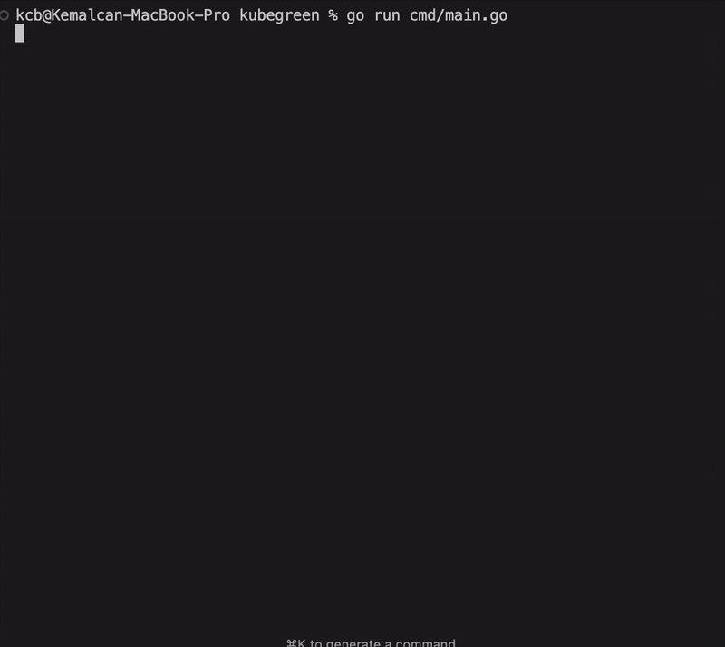

# KubeGreen

KubeGreen is a terminal-based Kubernetes management tool that provides an interactive interface for common Kubernetes operations.

## Demo



## Features

- **Context Management**: 
  - List available Kubernetes contexts
  - Switch between contexts easily
  - View current context

- **Pod Management**: 
  - List all pods across namespaces
  - View detailed pod information:
    - Status
    - Ready state
    - Restart count
    - Age
    - Node allocation

- **Certificate Management**: 
  - View TLS certificates
  - Check expiration dates
  - Monitor certificate status
  - Renew certificates
  - View certificate details including serial numbers

- **Volume Management**: 
  - List all Persistent Volume Claims (PVCs)
  - Delete PVCs safely with:
    - Automatic deployment scaling
    - Pod termination handling
    - Safe cleanup process

## Prerequisites

- Go 1.22 or higher
- Access to a Kubernetes cluster
- `kubectl` configured with proper contexts

## Installation

```bash
# Clone the repository
git clone https://github.com/yourusername/kubegreen.git
cd kubegreen

# Build the project
go build -o kubegreen cmd/main.go

# Run the application
./kubegreen
```

## Usage

Navigate through the interface using:
- Arrow keys (↑/↓) or `j`/`k` to move up/down
- `Enter` to select
- `Backspace` to go back
- `q` to quit
- `Esc` to cancel current operation

### Context Management
1. Select "contexts" from the main menu
2. View available contexts
3. Select a context to switch to it
4. Confirmation will be shown

### Pod Management
1. Select "pod" from the main menu
2. View list of all pods with:
   - Namespace
   - Name
   - Ready status
   - Current state
   - Restart count
   - Age
3. Select a pod to view detailed information

### Certificate Management
1. Select "certificates" from the main menu
2. View list of certificates with:
   - Namespace
   - Name
   - Days until expiration
   - Current status
3. Select a certificate to:
   - View detailed information
   - Renew if needed

### Volume Management
1. Select "volumes" from the main menu
2. View list of PVCs with:
   - Namespace
   - Name
   - Size
   - Status
3. Select a volume to delete
4. Confirm deletion
5. System will:
   - Scale down related deployments
   - Wait for pod termination
   - Delete the PVC
   - Show operation progress

## Project Structure

```
kubegreen/
├── cmd/
│   └── main.go           # Application entry point
├── internal/
│   ├── controller/       # Kubernetes operations
│   │   ├── contexts.go   # Context management
│   │   ├── pods.go      # Pod operations
│   │   ├── certificates.go # Certificate handling
│   │   └── volume_controller.go # Volume operations
│   └── model/           # UI models and state management
├── go.mod               # Go module file
└── README.md           # This file
```

## Contributing

1. Fork the repository
2. Create your feature branch (`git checkout -b feature/amazing-feature`)
3. Commit your changes (`git commit -m 'Add some amazing feature'`)
4. Push to the branch (`git push origin feature/amazing-feature`)
5. Open a Pull Request

## License

This project is licensed under the MIT License - see the LICENSE file for details.

## Acknowledgments

- Built with [Bubble Tea](https://github.com/charmbracelet/bubbletea) for terminal UI
- Uses the official [Kubernetes Go client](https://github.com/kubernetes/client-go) 